# liri-node-app

# **PURPOSE**

The LIRI *(_Language_ Interpretation and Recognition Interface)* node application is meant to take in user input and return data. LIRI is able to search Spotify songs, concerts, movies, read a text file and provide the user with data on the chosen topic.

# **LIRI DEMO**

The user can run node liri.js in the command line. The user will be asked what he/she would like to do and will be given the below choices:

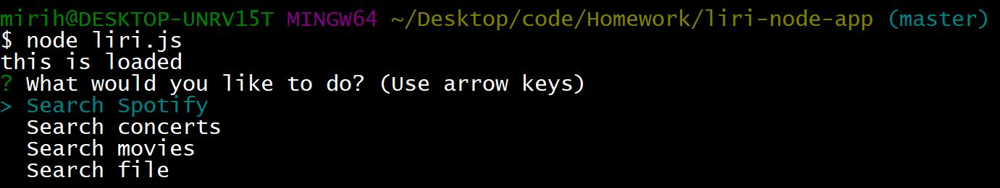

## **SPOTIFY**

When the user chooses to run the Search Spotify command he/she will be prompted to search for a song and the Spotify API will return data (i.e. total songs containing that title) to the user.

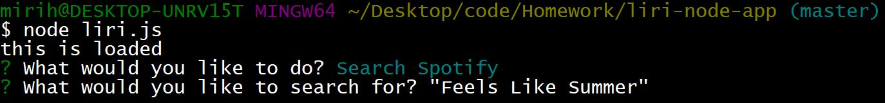
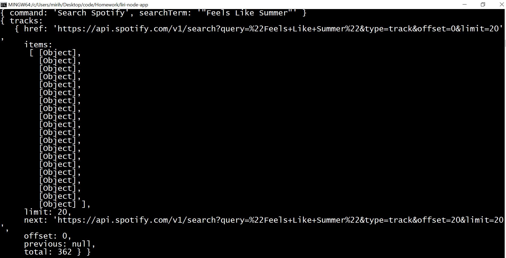

## **CONCERTS**

When the user chooses to run the Search concerts command he/she will be prompted to search for an artist or band name and the Bands in Town API will return data (i.e. venue & date of concert) to the user.

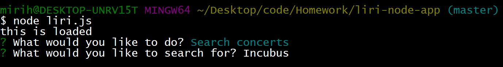
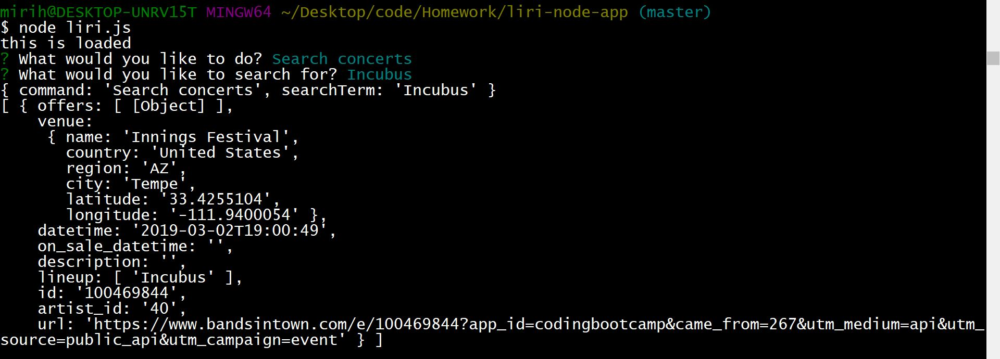

## **MOVIES**

When the user chooses to run the Search movies command he/she will be prompted to search for a movie and the OMDB API will return data (i.e. Title, Year, Release Date, Actors, etc.) to the user.

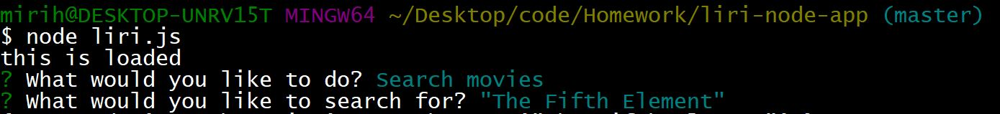
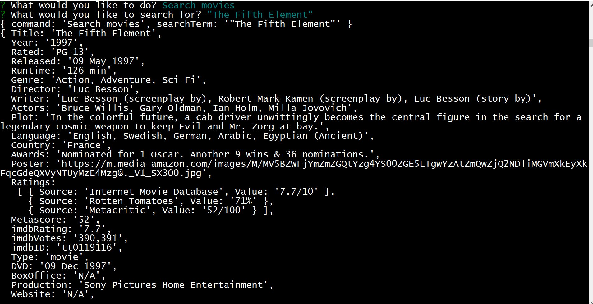

## **READ TEXT FILE**

When the user chooses to run Search file command he/she will be prompted to search for a file and the user must enter the filename random.txt as a response. LIRI will read and return what is contained in the file. 

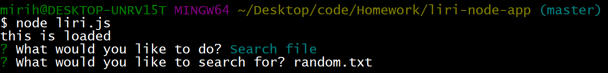
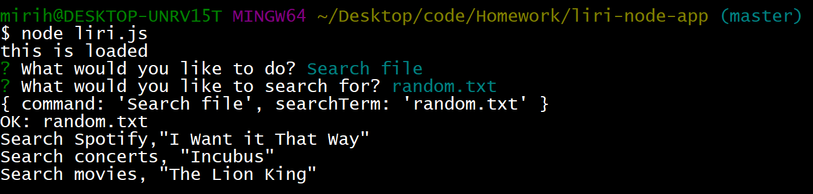

## **Portions that are Missing**
The text file part of the code was really meant to have LIRI use the information in the text file to run any of the three above commands (spotify, concerts, movies). I was unsuccessful in executing that portion of the code, therefore I left it so that LIRI could at least display the contents of the file.

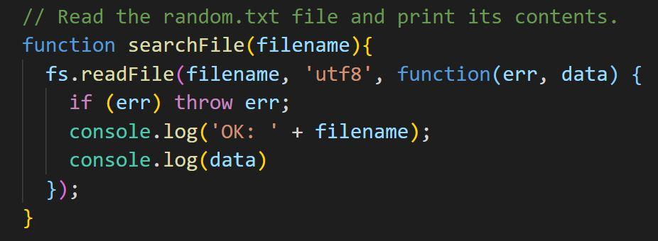

In addition, this assignment had a request where the npm package of moment should have been used to display the event date when searching events in this format: "MM/DD/YYYY". In the screenshot below I did install and required the moment npm package. However I was unsuccessful in implementing the code so it could specifially format the event date.

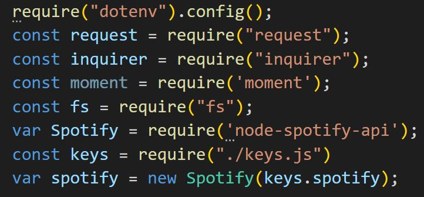

